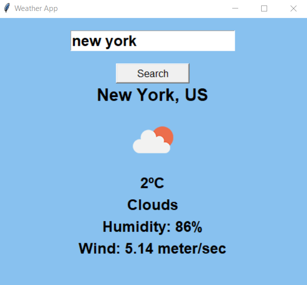

<h1>Building Python Weather App</h1>

<h3>We will use Weather API: https://openweathermap.org/api </h3>
<h3>Then we need to subscribe "Current Weather Data" to get the API key.</h3>
<h3> App version 2 using Tkinter </h3>

<h3> App version 1 </h3>

 I also use try and conditional statement. The app will print a message "No city found" if I enter incorrect city name.

 I use while loop to get the app check other city weather until I enter 'n' for no.

