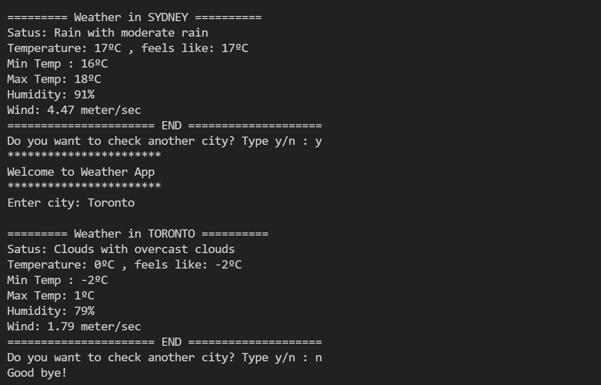
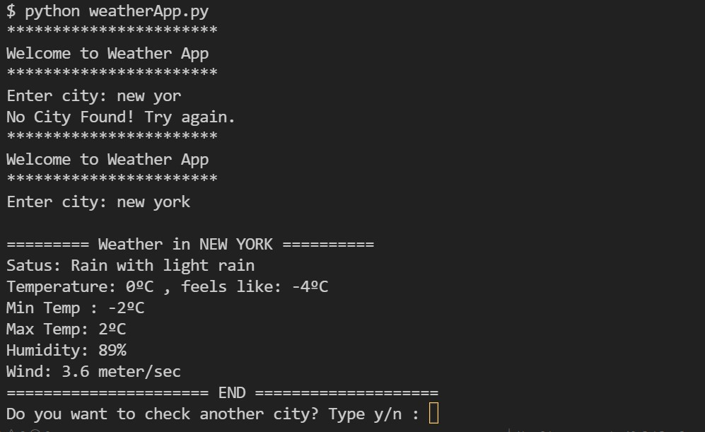

<h1>Building Python Weather App</h1>
<h3>We will use Weather API: https://openweathermap.org/api
Then we need to subscribe "Current Weather Data" to get the API key.</h3>
<h5> Step 1: </h5>

 I also use try and conditional statement. The app will print a message "No city found" if I enter incorrect city name.

<h5> Step 2: </h5>

 I use while loop to get the app check other city weather until I enter 'n' for no.

